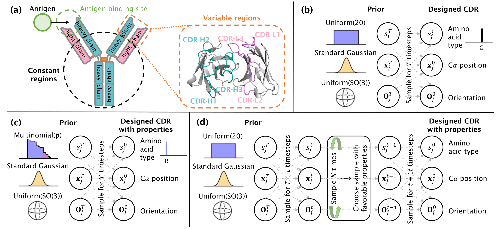

# Antibody-Diffusion-Properties

This repository contains the code to reproduce the results of the paper: "Guiding diffusion models for antibody sequence and structure co-design with developability properties".


*Figure: **(a)** Illustration of an antibody, featuring the two heavy (in blue) and two light (in pink) chains. The variable regions in the enlarged area encompass the antigen-binding site including the six CDR loops. **(b-d)** Visualization of the generative diffusion process, showcasing the prior distributions for each modality and the designed CDR, for the **(b)** property-unconditioned mode, **(c)** property-aware prior approach, and **(d)** sampling by property approach.*


## Background

This repository builds upon [(Luo et al. 2022) [DiffAb]](https://github.com/luost26/diffab) and [(Shan et al. 2022) [DDG Predictor]](https://github.com/HeliXonProtein/binding-ddg-predictor). To install the required packages, please refer to the documentation in the official repositories.

### Datasets and model weights

Protein structures in the **SAbDab** dataset for training and testing can be downloaded [here](https://opig.stats.ox.ac.uk/webapps/newsabdab/sabdab/archive/all/). Extract `all_structures.zip` into the `data` folder. The `data` folder contains a snapshot of the dataset index (`sabdab_summary_all.tsv`).

[[DiffAb]](https://github.com/luost26/diffab) model weights can be downloaded from either [[Hugging Face]](https://huggingface.co/luost26/DiffAb/tree/main) or [[Google Drive]](https://drive.google.com/drive/folders/15ANqouWRTG2UmQS_p0ErSsrKsU4HmNQc?usp=sharing). Copy the files into the `trained_models` folder. The model weights for [[DDG Predictor]](https://github.com/HeliXonProtein/binding-ddg-predictor) can be found in [`diffab/tools/ddg/data/model.pt`](diffab/tools/ddg/data/model.pt).


## Property-guided design of antibodies

The config files are in the `configs/test` folder. To design the six CDRs separately, use the `codesign_single` model and config on the scripts `design_pdb.py` (one sample) and `design_testset.py` (full test set, 19 samples). The lists of options are in the scripts [`diffab/tools/runner/design_for_pdb.py`](diffab/tools/runner/design_for_pdb.py) and [`diffab/tools/runner/design_for_testset.py`](diffab/tools/runner/design_for_testset.py), respectively.

### Property-unconditioned design

```bash
# Sample 7DK2_AB_C
python design_pdb.py ./data/examples/7DK2_AB_C.pdb \
  --config ./configs/test/codesign_single.yml

# Test set
for i in {0..18}; do
  python design_testset.py $i --config ./configs/test/codesign_single.yml
done
```

### Guiding design: Property-aware prior

For hydropathy-aware prior with $b$, specify the option `--prior_b` as:

```bash
# Sample 7DK2_AB_C
python design_pdb.py ./data/examples/7DK2_AB_C.pdb \
  --config ./configs/test/codesign_single.yml --prior_b 0.8

# Test set
for i in {0..18}; do
  python design_testset.py $i \
    --config ./configs/test/codesign_single.yml --prior_b 0.8
done
```

### Guiding design: Sampling by property

For sampling by property (ddG, hydropathy, or both), use the following config files:

| Config file              | Description                                                  |
| ------------------------ | ------------------------------------------------------------ |
| `codesign_single_ddg.yml` | Sequence-structure of one CDR, **sampling by ddG**. |
| `codesign_single_hydro.yml` | Sequence-structure of one CDR, **sampling by hydropathy**. |
| `codesign_single_ddg_and_hydro.yml` | Sequence-structure of one CDR, **sampling by ddG and hydropathy**. |

Here, the extra options are: `--sample_step_mode` ("min", "max", or "softmax"), `--sample_step_num` (int), and `--sample_step_period` (int). For example, for sampling by ddG use:

```bash
# Sample 7DK2_AB_C
python design_pdb.py ./data/examples/7DK2_AB_C.pdb \
  --config ./configs/test/codesign_single_ddg.yml \
  --sample_step_mode min --sample_step_num 20 --sample_step_period 1

# Test set
for i in {0..18}; do
  python design_testset.py $i \
    --config ./configs/test/codesign_single_ddg.yml \
    --sample_step_mode min --sample_step_num 20 --sample_step_period 1
done
```

### Evaluation

To compute the evaluation metrics: AAR, RMSD, Hydropathy Score, and Predicted ddG (the option `--no_energy` prevents the computation of Rosetta ddG) for all samples use:

```bash
python eval.py --no_energy --root results/codesign_single
```

### Other options

For training details and more design options, such as "Fix-backbone Design", "Antibody Optimization", or "Antigen Only", please refer to the original implementation of [[DiffAb]](https://github.com/luost26/diffab).


## References

If you find this repository useful in your research, please cite the following works.

```bibtex
@article{villegas2023guiding,
  title={Guiding diffusion models for antibody sequence and structure co-design with developability properties},
  author={Amelia Villegas-Morcillo and Jana M. Weber and Marcel J.T. Reinders},
  journal={NeurIPS 2023 Generative AI and Biology Workshop},
  year={2023},
  url={https://openreview.net/forum?id=bPcgbKDCUQ}
}

@inproceedings{luo2022antigenspecific,
  title={Antigen-Specific Antibody Design and Optimization with Diffusion-Based Generative Models for Protein Structures},
  author={Shitong Luo and Yufeng Su and Xingang Peng and Sheng Wang and Jian Peng and Jianzhu Ma},
  booktitle={Advances in Neural Information Processing Systems},
  editor={Alice H. Oh and Alekh Agarwal and Danielle Belgrave and Kyunghyun Cho},
  year={2022},
  url={https://openreview.net/forum?id=jSorGn2Tjg}
}

@article{shan2022deep,
  title={Deep learning guided optimization of human antibody against SARS-CoV-2 variants with broad neutralization},
  author={Shan, Sisi and Luo, Shitong and Yang, Ziqing and Hong, Junxian and Su, Yufeng and Ding, Fan and Fu, Lili and Li, Chenyu and Chen, Peng and Ma, Jianzhu and others},
  journal={Proceedings of the National Academy of Sciences},
  volume={119},
  number={11},
  pages={e2122954119},
  year={2022}
}
```
